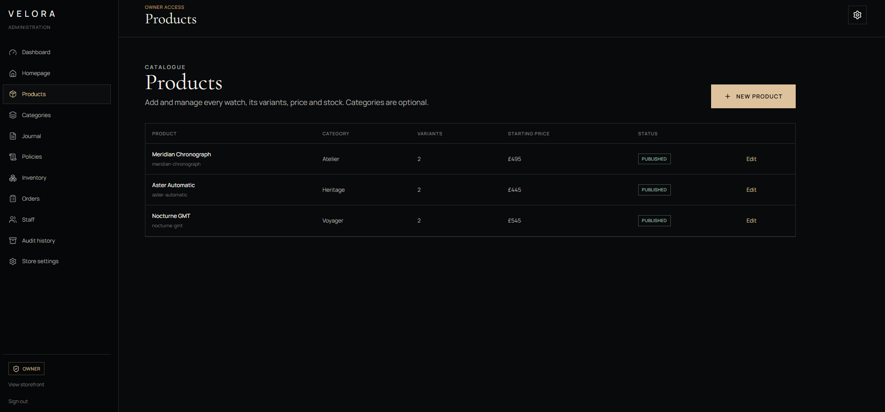

# Velora

    

[Live storefront](https://velora-storefront.highforce.workers.dev)

Velora is a responsive luxury watch storefront and commerce administration app built with Astro, TypeScript, Supabase, Stripe Checkout and Cloudflare Workers. It includes the customer shopping experience, passwordless customer accounts, a role-based admin area, database migrations and automated checks.

## Screenshots

These screenshots show the storefront and product administration using the sample catalogue included with the project.


| Watch catalogue | Product page |
| --- | --- |
|  |  |

### Product administration

The staff admin includes a product catalogue for editing watches, categories, variants, prices and publication status.



## What’s included

### Storefront

- Homepage with a two-slide, user-selectable hero, benefit strip, featured watches, collection links and journal story.
- Watch and category listings, product details, image galleries, specifications, variant pricing and availability.
- Search, a browser-persisted shopping bag, responsive navigation and informational pages for the brand, shipping, returns, privacy and terms.
- Journal listing and article pages, with staff-authored Markdown rendered through an HTML sanitizer.
- Published product and editorial content loaded from Supabase, with a bundled catalogue available as a public-page fallback.

### Customer accounts and checkout

- Passwordless sign-in by email code, customer profile, delivery addresses and account deletion requests.
- Order history and detail pages with item, payment, fulfilment, tracking and receipt information.
- Stripe-hosted Checkout. The app stores Stripe identifiers and order price snapshots; it does not collect or store card numbers.
- Stock reservations created in a database transaction before checkout, with signed webhooks to finalise paid orders and release failed or expired reservations.
- A scheduled Worker job that releases reservations left without a completed Checkout Session.

### Staff administration

- Product, variant, category, media, homepage, navigation, journal, policy and site-setting editors.
- Draft and publish workflows with version checks, audit history and role-based access for owners, editors and fulfilment staff.
- Inventory overview, low-stock warnings, stock adjustments, order fulfilment and staff management.
- Signed media uploads to Supabase Storage.

### Project files

```text
src/components/       shared storefront and admin components
src/data/             bundled fallback catalogue and editorial content
src/layouts/          storefront, account and admin layouts
src/lib/server/       auth, content, validation, admin and commerce services
src/pages/            storefront, customer account and admin routes
src/pages/api/         same-origin form handlers and Stripe webhook
supabase/migrations/  database schema, access rules and transaction functions
supabase/tests/       database and Row Level Security tests
tests/                unit tests for cart, HTTP, checkout and admin permissions
docs/screenshots/     storefront and admin screenshots used in this README
```

## Technology

- **Astro** renders server pages and handles routes; the storefront uses small browser scripts rather than a client-side application framework.
- **Supabase** provides passwordless authentication, PostgreSQL with Row Level Security, and image storage.
- **Stripe Checkout** hosts payment entry and sends signed events to the webhook endpoint.
- **Cloudflare Workers** hosts the app and runs the scheduled reservation cleanup.
- **Vitest, ESLint and Astro Check** cover unit tests, linting and framework/type diagnostics.

## Requirements

- Node.js 22.12 or newer and pnpm.
- Docker for the local Supabase stack.
- Stripe CLI for local webhook forwarding.
- A Cloudflare account and Wrangler login only when deploying.

## Local setup

Create local environment files and install dependencies:

```bash
cp .env.example .env
cp .dev.vars.example .dev.vars
pnpm install
```

Start and seed the local database, then start the storefront:

```bash
pnpm db:start
pnpm db:reset
pnpm dev
```

Set the values in `.env` using the local Supabase credentials printed by `pnpm db:start`. The public storefront can use the bundled catalogue when Supabase is unavailable; sign-in, checkout, database-backed content and administration need the corresponding service configuration. Local email codes can be read from the Mailpit address printed by Supabase.

`pnpm db:reset` recreates the **local** database, applies migrations and loads the sample watches, variants, inventory and published content from `supabase/seed.sql`. Never point this command at a hosted database containing customer data.

### Stripe test checkout

In a second terminal, forward Stripe test events to the local webhook:

```bash
stripe listen --forward-to http://127.0.0.1:4321/api/stripe/webhook
```

Put the signing secret printed by Stripe CLI in `.env` as `STRIPE_WEBHOOK_SECRET`, then restart the dev server. Use Stripe test mode and its standard test card `4242 4242 4242 4242` with any future expiry and three-digit security code.

## Environment variables

`.env.example` lists the variables used by Astro. `.dev.vars.example` is the Cloudflare local-development template. Keep populated environment files out of Git; `.env` and `.dev.vars` are ignored.

| Variable | Purpose | Exposure |
| --- | --- | --- |
| `PUBLIC_SUPABASE_URL` | Supabase project endpoint | Public |
| `PUBLIC_SUPABASE_PUBLISHABLE_KEY` | Restricted client key for Supabase | Public |
| `PUBLIC_SITE_URL` | Canonical origin used for links and callbacks | Public |
| `SUPABASE_SECRET_KEY` | Server-side administrative database access | Secret |
| `STRIPE_SECRET_KEY` | Server-side Stripe API access; currently test keys only | Secret |
| `STRIPE_WEBHOOK_SECRET` | Verifies Stripe webhook signatures | Secret |

The `PUBLIC_` values are intended to be visible to the browser. Never expose the Supabase secret key or Stripe secrets in client code, logs, committed environment files or `wrangler.jsonc`.

## Customer and staff access

Customers sign in with a six-digit email code. To grant the first owner, create an account by signing in once with the intended email, configure the local Supabase URL and secret key in `.env`, then run:

```bash
pnpm admin:grant-owner owner@example.com
```

This command stops if an active owner already exists. Owners can add staff and assign roles in `/admin/staff`.

| Role | Main access |
| --- | --- |
| Owner | Full admin access, including prices, configuration, staff and audit records |
| Editor | Products, collections, media, homepage, journal and policies |
| Fulfilment | Orders, tracking, reservations and inventory adjustments |

Roles come from protected staff records and are rechecked on administrator requests, rather than read from editable customer profile metadata.

## Checkout flow

1. The server reloads variant prices, publication status and available stock; browser-submitted prices are ignored.
2. A PostgreSQL transaction locks inventory in SKU order and creates a 30-minute reservation.
3. Stripe creates or reuses the customer and opens a hosted Checkout Session after database locks are released.
4. Failed session creation releases the reservation. Signed, idempotent webhook events finalise paid orders or release expired and failed sessions.
5. The success page can finalise a paid session if webhook delivery is delayed. The scheduled Worker also cleans up orphaned reservations.

Inventory changes are recorded in an append-only movement ledger. The database and Stripe integration are configured for test-mode payments; this repository is not ready to process real orders.

## Checks

```bash
pnpm lint
pnpm test
pnpm typecheck
pnpm build
pnpm db:test
```

`pnpm verify` runs lint, unit tests, Astro diagnostics and the production build. Database tests require the local Supabase stack. Before a release, also exercise a Stripe test purchase and check the site at mobile, tablet and desktop widths with keyboard navigation and reduced motion enabled.

## Deployment

1. Link the intended Supabase project with `supabase link --project-ref <project-ref>` and apply reviewed migrations with `supabase db push`.
2. Load reviewed seed content into a development project only. Do not reset a hosted database that contains customer data.
3. Set the public Worker variables in the deployment configuration and configure the three secrets in Cloudflare. `pnpm secrets:sync` uploads `SUPABASE_SECRET_KEY`, `STRIPE_SECRET_KEY` and `STRIPE_WEBHOOK_SECRET` from `.dev.vars` using Wrangler.
4. Register `/api/stripe/webhook` in Stripe test mode for `checkout.session.completed`, `checkout.session.expired`, `checkout.session.async_payment_succeeded` and `checkout.session.async_payment_failed`.
5. Run `pnpm deploy` with Wrangler logged in to the intended account. The command builds the app before publishing the Worker and its scheduled cleanup trigger.

Before enabling live commerce, replace the test-only Stripe integration, review legal and policy copy, configure production email delivery and monitoring, and complete a security review. The sample catalogue, contact details, policies and inventory are starting content and need review before a public launch.
